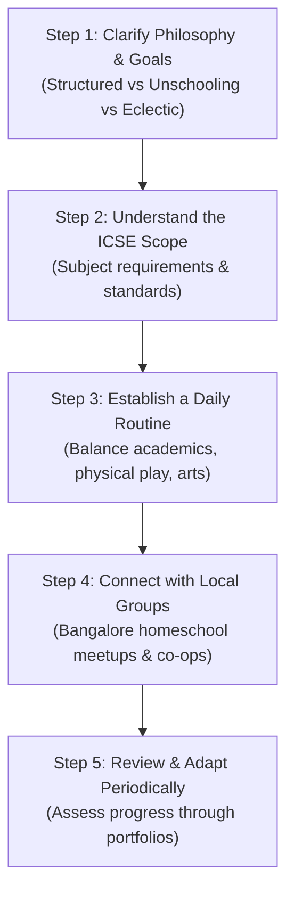

# 🚀 Getting Started with Homeschooling in Bangalore

Welcome to the journey of homeschooling! Whether you are contemplating taking your child out of formal schooling or embarking on an early childhood homeschooling path, this guide provides the foundational context for families based in **Bangalore, Karnataka**, and across India.

---

## 🏛️ Legal Framework in India & Karnataka

### 1. The Right to Education (RTE) Act, 2009
- The Right of Children to Free and Compulsory Education Act (RTE), 2009 guarantees the right of every child aged 6 to 14 to receive free and compulsory elementary education.
- **Homeschooling Position**: The Ministry of Human Resource Development (MHRD, now Ministry of Education) clarified in affidavits and responses that parents who choose to educate their children at home through alternate modes are not prohibited by the RTE Act, provided the child's right to education is fulfilled.
- In Karnataka, homeschooling is an accepted choice among hundreds of families. Several homeschoolers go on to excel in national and international examinations, sports, arts, and entrepreneurship.

### 2. Examination and Certification Pathways
Homeschooled children have multiple pathways to obtain recognized 10th and 12th standard certificates:
1. **ICSE / CISCE via Affiliated School Registration**:
   - Registering as an external candidate or through an accommodating ICSE school in Class 9 for the ICSE Class 10 board examination.
2. **NIOS (National Institute of Open Schooling)**:
   - A recognized national board offering Open Basic Education (OBE) for Level A (Class 3), Level B (Class 5), and Level C (Class 8).
   - Secondary (Class 10) and Senior Secondary (Class 12) examinations with complete flexibility in subject choice.
3. **IGCSE / Cambridge (CIE)**:
   - Registration as a private candidate through the British Council or registered Cambridge private exam centers in Bangalore.

---

## 📍 Setting Up Your Homeschool Space in Bangalore

1. **Learning Environment**:
   - Create a quiet, well-lit reading and working corner.
   - Equip with a whiteboard, stationery organizer, and child-accessible book shelves.
2. **Utilizing Bangalore's Educational Ecosystem**:
   - **Science & Astronomy**: Visvesvaraya Industrial and Technological Museum (VITM), Jawaharlal Nehru Planetarium, HAL Aerospace Museum.
   - **Nature & Ecology**: Lalbagh Botanical Garden, Cubbon Park, Bannerghatta Biological Park, IISc campus tree walks.
   - **Libraries**: State Central Library (Cubbon Park), British Council Library, local community libraries (e.g., Hippocampus, Atta Galatta).
   - **Tech & Maker Spaces**: Local maker spaces, robotics clubs, and coding dojos across Koramangala, Indiranagar, Whitefield, and HSR Layout.

---

## 📋 Recommended First Steps

