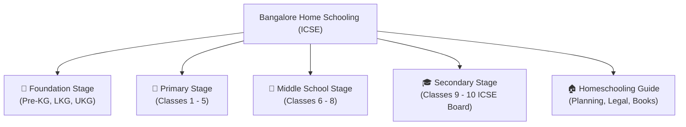

# 📚 Bangalore Home Schooling: ICSE Curriculum Portal

Welcome to the **Bangalore Home Schooling** open-source repository and educational portal! This resource is designed by and for homeschooling families, independent learners, and educators in Bangalore and across India following the **Indian Certificate of Secondary Education (ICSE / CISCE)** curriculum.

---

## 🎯 Our Mission

Home schooling offers the flexibility to tailor learning to a child's unique curiosity, pace, and passions. However, navigating the rigorous and comprehensive ICSE syllabus independently can feel daunting. 

This repository bridges that gap by providing:
- 📖 **Clear, Concept-First Notes** covering all subjects from **Pre-KG to Class 10**.
- 📝 **Structured Question Banks** (MCQs, 2-mark definitions, 3-mark conceptual questions, and 5-mark structured questions with marking schemes).
- 🖨️ **Printable Worksheets & Learning Assets** (diagrams, flashcards, formula sheets).
- 🧭 **Homeschooling Guidance for Bangalore & Karnataka** (legal rights, curriculum schedules, assessment methods, and board exam registration pathways).

---

## 🏫 Curriculum Navigation by Stage

### [1. 🌱 Foundation Stage (Pre-KG to UKG)](/docs/foundation/overview)
Focuses on early childhood development, play-based learning, phonemic awareness, pre-math concepts, sensory exploration, and fine motor skills based on the CISCE Preschool Guidelines and NEP Foundation Stage principles.

### [2. 🎒 Primary Stage (Classes 1 to 5)](/docs/primary/overview)
Lays solid foundational literacy, numeracy, environmental awareness, and logical thinking. Covers English, Mathematics, Environmental Studies (EVS) / General Science, Social Studies, Second Languages (Hindi/Kannada), and Computer Basics.

### [3. 🔬 Middle School Stage (Classes 6 to 8)](/docs/middle-school/overview)
Transitions students into distinct academic disciplines: Physics, Chemistry, Biology, History & Civics, Geography, Mathematics (Algebra, Geometry, Mensuration), English Language & Literature, and Computer Studies.

### [4. 🎓 Secondary Stage (Classes 9 & 10 - ICSE Board)](/docs/secondary/overview)
Comprehensive preparation for the CISCE ICSE Board Examinations. Includes in-depth chapter notes, 10-year previous questions, specimen question paper analysis, project/internal assessment guidelines, and solved numericals.

### [5. 🏠 Homeschooling Guide & Resource Center](/docs/homeschooling-guide/getting-started)
Practical advice for Bangalore parents:
- Legal status of homeschooling under RTE in India & Karnataka
- Annual planning, weekly timetables, and term splits
- Assessment rubrics and portfolio creation
- Recommended ICSE textbook publishers (Selina, Morning Star, Frank, Goyal Brothers)
- Digital simulations (PhET, GeoGebra, Khan Academy) and local field trip spots in Bangalore

---

## 🤝 How to Contribute

This portal is open source and community driven. Parents, educators, and students are welcome to contribute:
- Add chapter summaries, mind maps, and diagrams
- Submit question banks with step-by-step solutions
- Share printable worksheets and revision flashcards
- Fix typos and update syllabus changes

See our [GitHub Repository](https://github.com/karthik-r-bdump/bangalore-home-schooling) to get involved!
