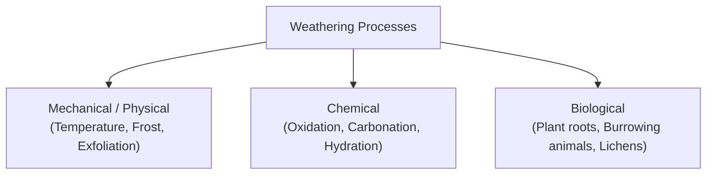

# ⛰️ Weathering & Soil Formation

Weathering is the disintegration (breaking down) and decomposition (decay) of rocks in situ (in their original place) on the Earth's surface.

---

## 🔬 Types of Weathering



---

## 📝 Practice Questions & Solved Guide

```markdown
SOIL AND ROCK FORMATION
                            Chapter End Exercises & Exact Textbook Answers


 Note to Students: This reference sheet contains the questions at the end of Chapter 4 ("Weathering and Soil
 Formation" / "Soil and rock formation.pdf") and their corresponding answers. All answers are exact quotations
 taken verbatim from the course materials, preserving the original phrasing and terminology to ensure complete
 accuracy for exams and revision.


 EXERCISE 1: ANSWER THE FOLLOWING QUESTIONS

 a. What is rock cycle? Explain.

    "The three categories of rocks are constantly forming from one another in a continuous circuit which is known
    as Rock cycle."
    "When igneous rocks are exposed to weather changes, they are broken and eroded and give birth to
    sedimentary rocks. Due to excessive heat and pressure, these rocks further undergo a change into
    metamorphic rocks. Thus, this cycle of change from one type of rock into another is called Rock cycle."


 b. How does the change in temperature help in the process of weathering?

    "Due to temperature changes- The rocks are composed of minerals which have different rates of heating and
    cooling. During day, the temperatures are high and expansion of rocks take place. During the night, the
    temperatures fall and contraction of the rocks take place. As the rate of expansion and contraction of the
    minerals of which the rock is composed, is different at various temperatures, the rocks break up into blocks
    or as grains depending on the rock structure."
    "The rocks may also disintegrate through the peeling off of the outer layer of the rocks. Due to the combined
    effect of temperature and wind, the outer layer loosened by contraction and expansion of the rock is
    removed."
    "As there is a great difference between the day and night temperatures in the desert areas, such type of
    weathering due to temperature changes is common in the hot deserts."


 c. Explain the process of weathering by frost action.

    "Due to frost action- Sometimes water gets collected in the cracks in the rocks. When the temperature is low,
    this water freezes and expands and cracks the rocks but when the temperature is high, the volume of water
    is reduced due to melting of ice. Freezing water, has increased volume that exerts pressure on the rock and
    widens the cracks. This pressure is released when the ice melts. Continuous action causes the disintegration
    of the rocks. Such weathering is common in the cool and temperate climate regions."


GROUNDED VERBATIM STUDY GUIDE                        Page 1                                    ICSE Model GEOGRAPHY
SOIL AND ROCK FORMATION — EXERCISE Q&A KEY                                                        GEOGRAPHY GRADE 7


 d. How does the chemical weathering effect the rocks?

    "Chemical weathering results in the decay and decomposition of the rocks which involve a change in both
    the physical as well as chemical properties of the rock."
    "It is mainly carried out by chemical reaction of minerals of the rock mainly with water in the atmosphere; this
    water is combined with the various gases present in the atmosphere."


 e. Mention the various ways in which plants and animals help in the process of weathering.

    By plants: "The roots of the plants and trees penetrate deep below the earth's surface. They sometimes
    reach the cracks in the rocks and widen the cracks leading to physical disintegration of the rocks."
    By animals: "Burrowing animals dig holes or burrows and tunnels below the earth's surface and this results
    in the gradual disintegration of the rocks."
    By human beings (Additional context): "Mining activities for extraction of minerals, blasting of hills for
    making roads and tunnels and other activities result in physical disintegration of rocks and increase the rate
    of weathering of rocks."


 f. Describe a typical soil horizon.

    "The vertical section of the soil showing its different layers is known as soil profile. There are different
    horizons of soil such as topsoil, subsoil, parent rock and bedrock."
    A-Horizon (Topsoil): "The uppermost layer of the Earth is known as A-horizon or topsoil. The major content
    of this section is humus. This makes it generally blackish-brown in colour. The topsoil is soft and porous. It
    has a good water retaining capacity. It is a habitat of many tiny organisms."
    B-Horizon 
```

---

## 📥 Downloadable Assets
- 📘 [Download Weathering & Soil Flashcards PDF](/bangalore-home-schooling/assets/class-7/geography/02-weathering-and-soil-flashcards.pdf)
