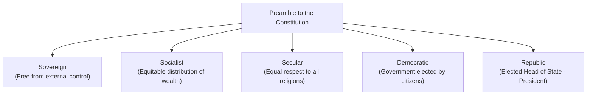

# 📜 The Constitution of India

The Constitution of India is the supreme law of the nation, providing the legal and political framework under which all citizens and institutions function.

---

## 🏛️ Key Features & Preamble



- **Constituent Assembly**: Chaired by Dr. Rajendra Prasad; Drafting Committee chaired by **Dr. B.R. Ambedkar**.
- **Adoption Date**: 26th November 1949.
- **Enforcement Date**: 26th January 1950 (celebrated as Republic Day).

---

## 📝 Solved Questions & Study Guide

```markdown
ICSE CLASS 7 CIVICS

 THE CONSTITUTION OF INDIA
 Official End-of-Chapter Exercises & Verbatim Reference Answers


 This study guide contains a complete and presentable record of all the exercises and questions from the end of
 the chapter 'The Constitution of India'. To support academic excellence and exact alignment with school
 grading guidelines, every single answer in this guide is derived verbatim from the official textbook sources. For
 questions where the source text contains structural omissions, typographical errors, or gaps, clear editorial
 annotations are provided to maintain full academic transparency.


 SECTION A: BRIEF QUESTIONS
 Q1. Define Constitution.
 Answer: “The Constitution of a country is a set of written rules that are accepted by all people living together in a
 country. Constitution is the supreme law that determines the relationship among people living in a territory (called
 citizens) and also the relationship between the people and the government.”

 Q2. What is Constituent Assembly?
 Answer: “Our Constitution was framed by an assembly of elected representatives called Constituent Assembly.”

 Q3. How many members were there in the Constituent Assembly?
 Answer: “The Constituent Assembly that wrote the Indian constitution had 299 members.”

 Q4. Name any four members of the Constituent Assembly.
 Answer: “Jawaharlal Nehru, Rajendra Prasad, Sardar Patel, Maulana Abul Kalam Azad, Syama Prasad Mookerji,
 Sardar Baldev Singh, etc., were some of the important leaders who guided the discussions in the Assembly.”

 Q5. Who represented the Anglo-Indian community in the Constituent Assembly?
 Answer: “Anglo-Indian community was represented by ICSE Model...”

 Q6. Who represented the Parsis in the Constituent Assembly?
 Answer: “...while Parsis were represented by H.P. Modi.”

 Q7. Who was the President of the Constituent Assembly?
 Answer: “...Dr. Rajendra Prasad was elected as the President of the Constituent Assembly”

 Q8. Who was the Chairman of the Drafting Committee?
 Answer: “This Committee was headed by Dr. B.R. Ambedkar, who was its Chairman.”


Grounded Verbatim in the Student's Textbook Sources       Page 1                                          ICSE Class 7 Civics
CIVICS STUDY GUIDE: THE CONSTITUTION OF INDIA                                         EXERCISES &amp; VERBATIM ANSWERS


 Q9. Why was the Constitution enforced on 26th January?
 Answer: “In December 1929, under the presidency of Jawaharlal Nehru, the Lahore Congress formalised the
 demand of 'Purna Swaraj' or complete independence for India. It was declared that 26th January 1930, would be
 celebrated as the Independence Day when people were to take a pledge to struggle for complete independence.”

 Editorial Note: The source text explaining the chosen enforcement date ends abruptly with: “Therefore to show
 respect the event of the Poornaswaraj the 26”. In historical reality, January 26 was designated to mark the 20th
 anniversary of Purna Swaraj Day (January 26, 1930).

 Q10. Define Universal Adult Franchise.
 Answer: “Every citizen of India who is at least 18 years of age can be a voter to elect the representatives to the
 Parliament and the State Legislatures. He possesses this right without any discrimination of caste, creed, colour, sex,
 religion or belief.”

 Q11. “Indian Constitution is both rigid and flexible.” Justify by giving an example.
 Answer: “Article 368 of the Constitution provides for the procedure of amendment in our Constitution. Some Articles
 can be amended by a simple majority vote in the Parliament. But some other Articles can be amended by 2/3 majority
 in both Houses of the Parliament.”

 Q12. Define Federalism.
 Answer: “Federalism is a system of government in which the power is divided between a Central authority (Union
 Government) and various state governments.”

 Q13. Name the apex court in India.
 Answer: “The Supreme Court is the apex court in the country.”


 SECTION B: DETAILED QUESTIONS

     Q1. Explain the importance of Constitution.
     Answer: “A Constitution does many things:
     First, it generates a degree of trust and coordination that is necessary for different kind of people to live together;
     Second, it specifies how the government will be constituted, who will have power to take which decisions;
     Third, it lays down limits on the powers of the government and tells us what the rights of the citizens are; and
     Fourth, it expresses the aspirations of th
```

---

## 📥 Learning Resources
- 📘 [Download Indian Constitution Blueprint PDF](/bangalore-home-schooling/assets/class-7/history-civics/03-indian-constitution-blueprint.pdf)
