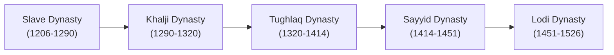

# 🏛️ The Delhi Sultanate (1206 – 1526 CE)

The Delhi Sultanate comprises five distinct dynasties that ruled northern India from 1206 to 1526 CE.

---

## 👑 The Five Dynasties Overview



1. **The Mamluk / Slave Dynasty (1206 – 1290)**:
   - **Qutb-ud-din Aibak**: Founder of the Sultanate, built Quwwat-ul-Islam mosque and started Qutb Minar. Known as *Lakhbaksh* (giver of lakhs).
   - **Shams-ud-din Iltutmish**: Real consolidator. Established the *Chahalgani* (Group of Forty) and introduced *Tanka* (silver) and *Jital* (copper) coins.
   - **Razia Sultan**: First and only female Muslim ruler of medieval India. Known for her courage and administrative acumen.
   - **Ghiyas-ud-din Balban**: Introduced the policy of *Iron and Blood*. Enforced court etiquette: *Sijdah* (prostration) and *Paibos* (kissing monarch's feet).

2. **The Khalji Dynasty (1290 – 1320)**:
   - **Ala-ud-din Khalji**: Famous for his military conquests in Gujarat, Rajasthan (Chittor), and South India (led by Malik Kafur). Strict market regulations and revenue reforms.

3. **The Tughlaq Dynasty (1320 – 1414)**:
   - **Ghiyas-ud-din Tughlaq**: Built Tughlaqabad fort.
   - **Mohammad-bin-Tughlaq**: Visionary yet impatient ruler known for ambitious experiments: taxation in Doab, shifting capital, token currency, and Khurasan expedition.
   - **Firoz Shah Tughlaq**: Known for public works, canals, hospitals (*Dar-ul-Shafa*), and founding cities like Firozabad and Jaunpur.

---

## 📝 Chapter Question Bank & Solved Exercises

```markdown
THE DELHI SULTANATE — EXCISE ANSWER KEY                                                            7TH GRADE HISTORY COMPANION


        THE DELHI SULTANATE (1206 – 1526 CE)
                         End-of-Chapter Q&A Guide & Detailed Explanation Companion


    Welcome, young historian! This document contains the complete and verified answer key for the exercises at the end of
    Chapter 3: 'The Five Dynasties of the Delhi Sultanate'. These answers are perfectly aligned with your textbook and structured
    specifically for a 7th-grade student. Tips and corrections for textbook errors (such as missing options or chronological
    mismatches) are highlighted in amber boxes to help you achieve a perfect score!


 SECTION A: BRIEF ANSWER QUESTIONS (1-2 SENTENCES)


 Q1: What is the Sultanate Period?
 Ans: The period between 1206 CE and 1526 CE is known as the Delhi Sultanate in Indian History, as the Muslim
 rulers of this era held the title of 'Sultan' and established Delhi as their capital city.

 Q2: Who was the first ruler of the Slave Dynasty?
 Ans: The first ruler of the Slave Dynasty was Qutb-ud-din Aibak, who assumed the title of Sultan in 1206 CE
 following the death of his master, Muhammad Ghori.

 Q3: 'Iltutmish had to face many problems.' Mention any two.
 Ans: Two major problems Iltutmish faced were: (1) As a former slave, he had no hereditary claim to the throne, and
 (2) his authority was challenged by other rival Turkish generals and governors who refused to accept his rule.

 Q4: Name the female ruler of the Delhi Sultanate.
 Ans: The only female ruler of the Delhi Sultanate was Razia Sultana, the daughter of Shamsuddin Iltutmish, who
 ruled Delhi courageously from 1236 CE to 1240 CE.

 Q5: Name the Delhi ruler who followed the 'Blood and Iron' policy.
 Ans: The stern and iron-willed Sultan Ghiyas-ud-din Balban followed the strict 'Blood and Iron' policy to ruthlessly
 suppress his opponents and secure the throne.

 Q6: Name the Delhi ruler who took various steps to control the prices and the market.
 Ans: Sultan Ala-ud-din Khalji introduced rigorous market reforms and fixed the prices of food grains, cloth, and
 essential goods to maintain a massive standing army.

 Q7: Who were 'Ulemas'?
 Ans: The Ulemas were orthodox scholars of Islamic learning who held significant religious and administrative
 influence in the royal court and generally opposed modern or unconventional changes.

 Q8: Name the ruler of the Sultanate Period who had built 'sarais'.
 Ans: Sultan Firoz Shah Tughlaq is famously credited with building one hundred sarais (rest houses) for the
 convenience and comfort of travelers, merchants, and traders.


Grounding: ICSE History Chapter 3                             Page 1                               Created for Students & Educators
Q9: Who was Timur?
Ans: Timur (also known as Tamerlane) was a powerful Turkish conqueror from Central Asia who invaded India in
1398 CE, causing massive plunder, destruction, and deaths in Delhi.

Q10: Who founded the Lodhi Dynasty?
Ans: The Lodhi Dynasty was founded by Bahlol Lodhi in 1451 CE, establishing the first ruling dynasty of Afghan
origin in the Delhi Sultanate.

Q11: Who was the last ruler of the Delhi Sultanate?
Ans: The last ruler of the Delhi Sultanate was Ibrahim Lodhi, who was defeated and killed on the battlefield in 1526
CE.

Q12: Who was the founder of the Mughal dynasty?
Ans: Babur, the ruler of Kabul, founded the Mughal dynasty in India after defeating Ibrahim Lodhi at the historic First
Battle of Panipat in 1526 CE.


SECTION B: DETAILED ANSWER QUESTIONS (DEEP DIVES)


Q1: Who ascended the throne after the death of Qutb-ud-din Aibak? Mention any two difficulties which he
had to face.
Ans: Following the sudden death of Qutb-ud-din Aibak in 1210 CE, his son-in-law Shamsuddin Iltutmish ascended
the throne in 1211 CE. He faced severe challenges from all directions:

• Lack of Hereditary Legitimacy: Because Iltutmish was originally a slave, his position was heavily challenged by
Ghori's other military generals who did not accept the authority of a former slave.

• Rebellions and Decentralization: Powerful governors of Bihar and Bengal actively rebelled to set up independent
kingdoms, while Rajput and Hindu princes attempted to seize control amidst the political confusion.


Q2: 'Balban had to face many problems in order to consolidate the Sultanate.' Explain. How did he overcome
these problems?
Ans: Ghiyas-ud-din Balban ascended t
```

---

## 📥 Learning Resources
- 📘 [Download Complete Delhi Sultanate Revision Guide PDF](/bangalore-home-schooling/assets/class-7/history-civics/01-delhi-sultanate-revision-guide.pdf)
- 🗂️ [Download Anki Flashcard Deck](/bangalore-home-schooling/assets/flashcards/delhi-sultanate-cards.colpkg)
